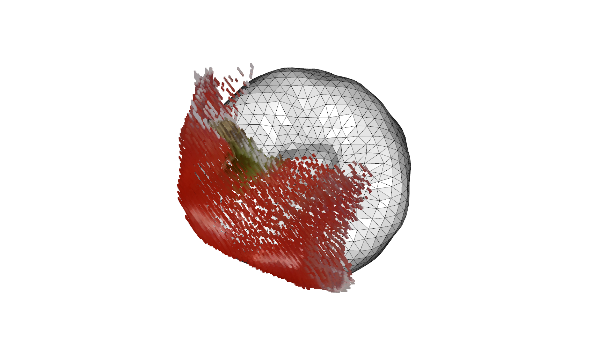

# Efficient and Accurate Transformer-Based 3D Shape Completion and Reconstruction of Fruits for Agricultural Robots

This repo will contain the code for the fruit completion and reconstruction method proposed in our ICRA'24 paper that you can find at this [link](https://www.ipb.uni-bonn.de/pdfs/magistri2024icra.pdf)


The main contribution of this paper is a novel approach
for completing 3D shapes combining template matching
with deep learning. First, we use a 3D sparse convolutional
backbone to extract point-wise features. We then aggregate
such features into vertex features and feed them to a transformer decoder that iteratively deforms our template. Such
an architecture allows us to estimate the complete 3D shape
of fruits when only a partial point cloud is available

## How to Install
<details>
  <summary>[Details (click to expand)]</summary>
We tested our code on a system with Ubuntu 22.04 and CUDA 11.8.

For compatibility reasons, we recommend creating a conda environment with Python 3.9:  <br>
`conda create --name tcore python=3.9 && conda activate tcore`

Installing python packages pre-requisites:

`sudo apt install build-essential python3-dev libopenblas-dev` <br>
`pip3 install -r requirements.txt`

Installing MinkowskiEngine:

`pip3 install -U git+https://github.com/NVIDIA/MinkowskiEngine -v --no-deps`  <br>
NB: At the moment, MinkowskiEngine is not compatible with python 3.10+, see this [issue](https://github.com/NVIDIA/MinkowskiEngine/issues/526#issuecomment-1855119728)

Install Pytorch3D:

`pip3 install "git+https://github.com/facebookresearch/pytorch3d.git"`

To setup the code run the following command on the code root directory:

`pip3 install -U -e .`
</details>

## How to Run
<details>
  <summary>[Details (click to expand)]</summary>

**Train**

Run `python tcore/scripts/train_model.py` to train our approach, where parameters are specified in the config `tcore/config/model.yaml`.

You can use `--model_cfg_path <path-to-cfg>` to specify a different configuration file.

**Test**

Run `python tcore/scripts/evaluate_model.py --w <path-to-checkpoint>` for inference and computing metrics with the directory specified in `tcore/config/model.yaml`.

You can use `--model_cfg_path <path-to-cfg>` to specify a different configuration file.
</details>

## Running our Approach on Sample Data
<details>
  <summary>[Details (click to expand)]</summary>

For running the demo of our approach, we assume that you are using Ubuntu 22.04 with a CUDA-capable device, but the scripts can be adapted to other platforms.
We assume that you are in the root directory of the repository. We prepare a small sample dataset for testing this repo.

1. Download and extract the sample data: `sh scripts/download_data.sh`
2. Download the checkpoint of our trained model: `sh scripts/download_checkpoint.sh`

These commands will download the dataset and the checkpoint in `./data/` and `./checkpoints`, respectively. 

3. Run the inference on the data: `python tcore/scripts/demo.py --w  checkpoints/pretrained_model.ckpt`

You should get the following image on your machine:

</details>

## How to Cite

If you use this repo, please cite as:

```bibtex  
@inproceedings{magistri2024icra,
author = {F. Magistri and R. Marcuzzi and E.A. Marks and M. Sodano and J. Behley and C. Stachniss},
title = {{Efficient and Accurate Transformer-Based 3D Shape Completion and Reconstruction of Fruits for Agricultural Robots}},
booktitle = {Proc.~of the IEEE Intl.~Conf.~on Robotics \& Automation (ICRA)}, 
year = 2024,
}

